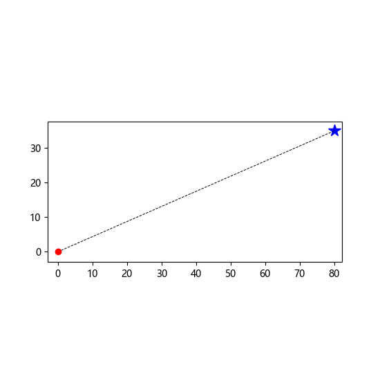
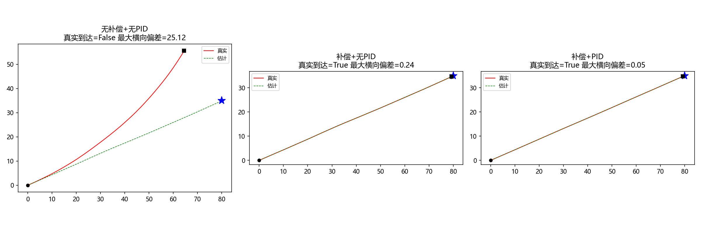

# Tripodal Piezoelectric Microrobot ｜ 高精度三足压电微型机器人

> 面向精密微操作应用的高精度压电驱动微型机器人：借鉴文献 [1] 提出的三足构型与全向运动机理，完成机械建模、控制算法的仿真实现与验证（MIL），目前正推进固件与板载电路开发。

<p align="center">
  
  
</p>

> 左：整机机械模型（三腿装配体）｜ 右：PTP 闭环导航 MIL 仿真动画

## 项目简介

- **运动机理**：三条压电腿 120° 径向分布——谐振点出推进力（OVS）、低频弹跳减摩擦（LBS）；3 个单驱 + 3 个双驱基向量，配合 K(θ) 力分配与轨迹插补实现**平面全向运动**；机载传感器 + PID 实现**点对点（PTP）闭环导航**，构型上力线过质心，天生产生零旋转扭矩（零转弯半径）。
- **目标应用**：半导体封装键合线检测（机器人作为微米级精密移动平台 + 显微图像拼接）、气体泄漏定位巡检、受限空间检测、多机协同。
- **本人负责**：机械建模（SolidWorks）、控制算法的仿真实现与验证（MIL）、ESP32 固件（开发中）、板载电路（规划中）、上位机与通信协议。

## 当前进度（更新 2026-09-12）

- [x] 文献调研与机理拆解（驱动原理 / 插补算法 / K(θ) 力分配 / PTP 导航 / 通信链路）
- [x] 机械建模（SolidWorks 装配体与零件，STEP/STL 已发布于 `model/`）
- [x] 控制算法 MIL 仿真：L1–L5 五个关卡全部通过验收
- [ ] ESP32 固件开发（三路波形生成 / 插补移植 / PTP 导航）
- [ ] 板载电路 PCB 设计
- [ ] 上位机与整机联调

## MIL 仿真模块说明

| 脚本 | 验证内容 | 机理出处（文献 [1]） |
|---|---|---|
| `simulation/L1_geometry.py` | 三腿轴线与 6 个基向量几何 | 补充 Fig. S4a |
| `simulation/L2_zigzag.py` | 双基向量交替插补之字线 + 阈值（致密化）扫描 | 补充 Note 2 + Fig. S4b |
| `simulation/L3_yaw.py` | 偏航漂移的危害与 IMU 指令预回转补偿 | 补充 Fig. S4c/d |
| `simulation/L4_ksynth.py` | K(θ)=sinθ/sin(120°−θ) 力分配公式自验 + 平滑路径对比 | 补充 Note 5 式(8) + Fig. S8c |
| `simulation/L5_ptp.py` | PTP 闭环导航：偏航补偿 + K 合成 + PID | 主文 Fig. 5 |

数值方法与逐行讲解见 [docs/MIL算法仿真教程.md](docs/MIL算法仿真教程.md)，实现思考见 [docs/MIL算法答疑-L2与L3.md](docs/MIL算法答疑-L2与L3.md)，交互式动画见 `simulation/motion_sim_L2.html` 与 `simulation/motion_sim_L4.html`（浏览器直接打开）。

PTP 闭环导航三组对照实验（无补偿 → 有补偿 → 补偿+PID，最大横向偏差 25.12 → 0.24 → 0.05）：



## 如何运行

```bash
python -m pip install matplotlib pillow
python simulation/L5_ptp.py    # L1 ~ L4 同理，按关卡编号递进
```

## 仓库结构

1. `simulation/` —— 控制算法 MIL 数值仿真（Python + matplotlib）与交互式 HTML 动画
2. `docs/` —— 文献调研笔记、MIL 仿真教程、答疑笔记与结果图
3. `model/` —— 机械模型（SolidWorks 导出的 STEP/STL，STL 点击可在网页直接 3D 预览）
4. `host/` —— 机器人模拟服务器（上位机联调用，后续扩展为上位机源码）

## 声明与致谢

- 本项目是基于公开文献 [1] 的**个人学习与工程实践项目**：机器人的构型、驱动原理与算法机理均出自文献 [1]，涉及的公式与性能参数在引用处逐条标注；
- 文献 [1] 未开源固件与仿真代码。本仓库中的 MIL 仿真程序、固件（开发中）与上位机代码为本人在文献机理基础上的**独立实现**；机械模型为依据文献公开结构参数（外形尺寸、四层堆叠布局等）自行建立的 CAD 模型；
- 本项目为个人学习性质，非文献 [1] 团队的官方项目，亦未受其授权或背书；
- 仓库不含任何第三方受版权保护的资料（论文原文与补充材料请通过官方渠道获取）；如原作者认为某些内容不适宜，请联系我，将及时处理；
- 感谢文献 [1] 作者公开的出色工作——本项目的全部工程实践均以其为基础。

## References

[1] Gao Y, Li J, et al. *Omnidirectional Motion of an Untethered Tripodal Microrobot Using Radial Piezoelectric Actuators*, **Nature Communications**, 2026, Article 5946. [https://www.nature.com/articles/s41467-026-72449-x](https://www.nature.com/articles/s41467-026-72449-x)
