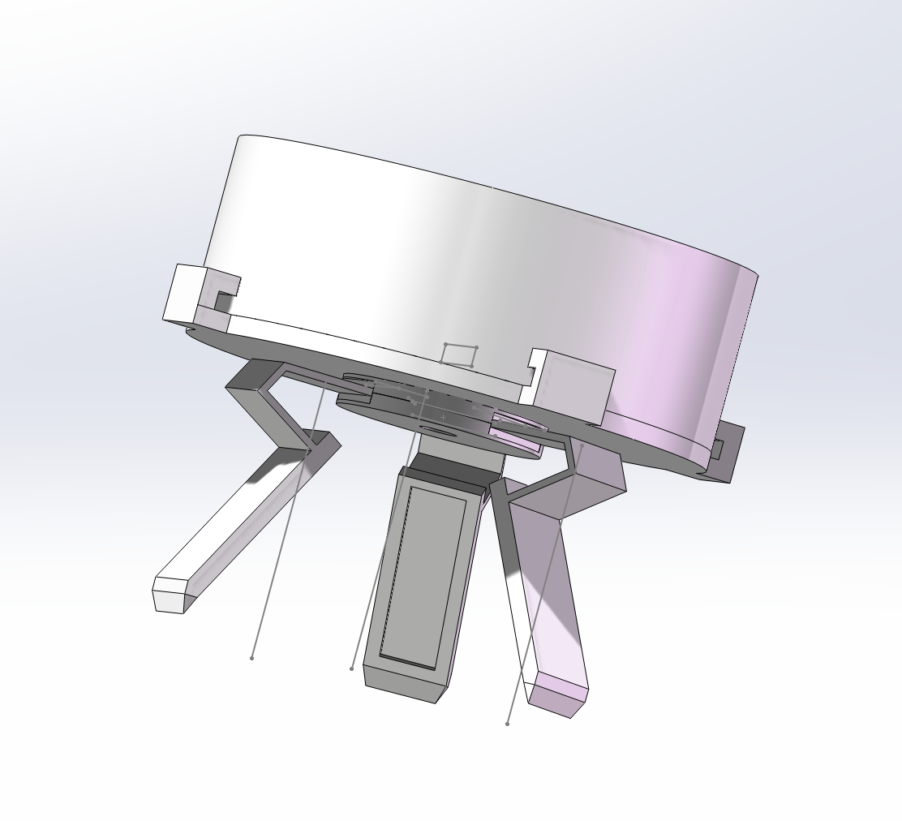

# model —— 机械模型

三足构型的机械设计由 SolidWorks 完成，包含三腿装配体及电池层上/下盖、三腿连接体、单条腿等零件。

## 文件说明

- `STEP/` —— 各零件与装配体的中性交换格式（STEP AP203，任意 CAD 软件可打开）
- `STL/` —— 同一套模型的 STL 格式，**在 GitHub 网页点击文件即可直接 3D 预览**

| 模型 | 说明 |
|---|---|
| `三腿装配体` | 整机三腿装配体（推荐先看这个） |
| `电池层上盖` / `电池层下盖` | 电池层结构 |
| `三腿连接体` | 三腿顶部连接体 |
| `单条腿V1` | 单条腿零件 |
